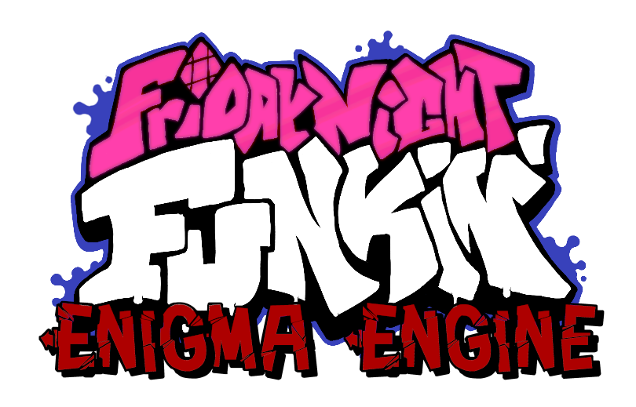

# Hello, friend!

# Friday Night Funkin': Engima Engine

### If you want to report an issue with Enigma Engine, read [this](https://github.com/EnigmaEngine/EnigmaEngine/issues/1).
### If you want to contribute to Engima Engine, read [this](https://github.com/EnigmaEngine/EnigmaEngine/issues/1) and scroll down to the Pull Requests section first.
### If you want to make mods using Enigma Engine, read [this](https://github.com/EnigmaEngine/EnigmaEngine/wiki/Modding-Guide).
### If you want to build Enigma Engine (DISCLAIMER: You shouldn't need to do this to create mods, read the above guide instead), read [this](https://github.com/EnigmaEngine/EnigmaEngine/wiki/building-enigma-engine). If you've already built the game before, you'll probably need to follow these steps anyway.

## What is Enigma Engine?

Enigma Engine is a project developed as a love letter to the open source game development community, and to the many talented people who have been developing mods for Friday Night Funkin'.

Built on Kade Engine v1.7.0, Engima is striving to provide features to help hardcore players improve, casual players have more fun with the game, 

## What is ModCore?

**DISCLAIMER: MODCORE HAS BEEN SUBMITTED TO AND APPROVED FOR A FUTURE VERSION OF KADE ENGINE. IT WAS ORIGINALLY DEVELOPED HERE.**

Engima's flagstone feature is its ModCore feature. Utilizing new improvements made to the Polymod library for Haxe, Enigma Engine boasts true mod support. No, not like the literal tens of thousands of people rebuilding the game with edited code to include new characters and songs, and no, not like Psych Engine which reads image files that you put in a folder.

I mean atomic, data driven, user configurable, flexible, scriptable, MODS. I mean being able to make full custom weeks without a single line of code, and add them to an existing install without having to redownload the WHOLE game executable and without risk of conflicts. I mean using the mod menu to easily reorder, enable, or disable mods with as much ease as managing texture packs in Minecraft.

Mods can currently do the following:
* Replace existing songs (music, charts, and song name).
* Replace any existing graphics.
	* It's easier than in vanilla to make new skins for existing characters, especially ones that are a different size or shape, since character offsets and animation prefixes are not hardcoded.
* Add new songs to Free Play.
* Add new characters to use in existing or custom songs.
* Add new animations to existing characters.
	* If you add new animations to the spritesheet and XML, then reference them in the character metadata JSON with the animation name `singDOWN-alt`, they should appear when using alt notes in the charter.
* Have song names include symbols without breaking stuff.
	* Add a `name` attribute to the `_meta.json` file of a `data/songs` folder to use a name that doesn't match the folder name.
* Modify existing dialog on songs that already have it.
* Redo the title sequence and intro credits (including support for custom graphics, check out the [Tricky Mod](https://github.com/EnigmaEngine/ModCore-Tricky-Mod) example).

Upcoming plans for modding support include:
* Add support for new weeks to Story Mode.
* Modifying existing weeks.
* Migrating existing weeks to mods (so they can be easily disabled or used as examples).
* Add support for custom stages with custom props.
* More song events.
* Custom dialogue for songs.
* Fully-fledged scripting support in HScript, 100 times more powerful than Lua modcharts. 
* Custom note types via scripting.

## Other Features

Enigma Engine also has the following features:
* All the features of Kade v1.7, including custom keybinds, togglable anti-mash, better input detection, and more.

## Media

Check out this demonstration, which showcases adding a new character and song to an existing installation without modifying the code:

Also check out these screenshots:

## Contributing

Feature requests, bug reports and ESPECIALLY pull requests are highly appreciated and can be provided on this repo.

More info on providing feature requests: LINK

More info on providing bug reports: LINK

More info on making contributions and pull requests: LINK

## Credits and Thanks

Enigma Engine was developed by:

* [MasterEric](https://github.com/MasterEric) developed the main engine based on the Kade Engine codebase.
* You! Seriously if you want to contribute assets or code, it would be greatly appreciated.

Enigma Engine would not be possible without these fine people:

* The developers of Haxe, OpenFL, Lime, and HaxeFlixel, who have built a powerful and open source framework for cross-platform game development.
* NinjaMuffin99 and the developers of Friday Night Funkin', for deciding not to wait for the online instant game ecosystem to resurrect itself.
* KadeDev and the contributors to Kade Engine, for developing its awesome features and the foundation upon which the skyscraper of Enigma is built.
* Lars Doucet, the game developer who has sunk loads of time, effort, and love into creating and maintaining [Polymod](https://github.com/larsiusprime/polymod) and other libraries for Haxe and HaxeFlixel, and especially for making the changes to Polymod that allowed this project to exist.
